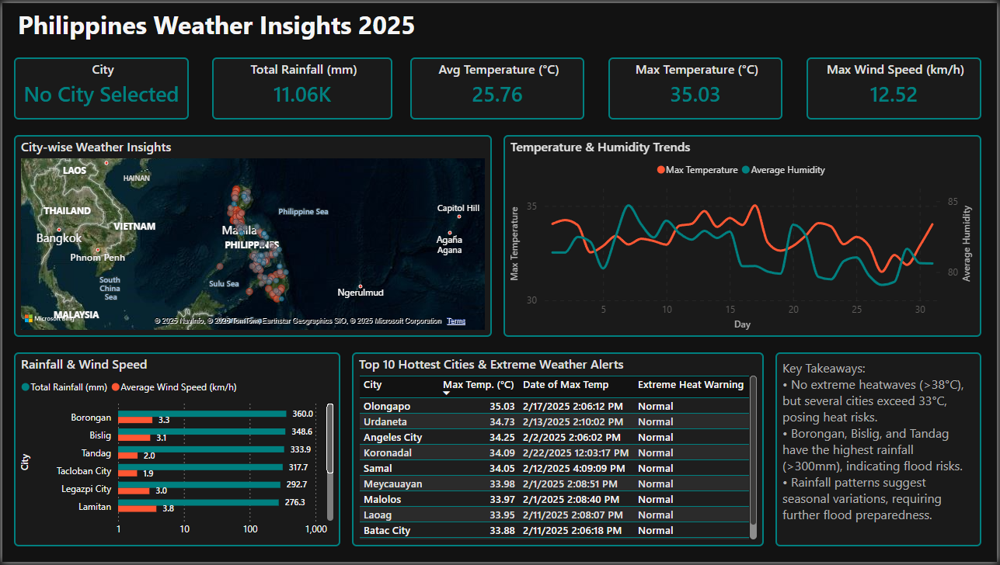

# Philippines Weather Insights 2025 – Power BI Dashboard

**Data Coverage:** January 2025 - February (Present Date), 2025  
**Tools Used:** SQL (Microsoft SQL Server), Power BI  
**Skills Demonstrated:** Data Wrangling, ETL, Dashboard Design, Data Visualization, Business Insights  

## **Power BI Dashboard**  


## **Problem Statement**  
The Philippines is prone to extreme weather conditions, including heatwaves, typhoons, and floods. Understanding weather patterns in major cities is critical for disaster preparedness, energy management, and urban planning.  

This project aims to answer:  
- Which cities experience the highest temperatures, and are there heatwave risks?  
- Which cities receive the most rainfall, potentially leading to flood hazards?  
- How does wind speed relate to heavy rainfall, and can it indicate storm formation?  
- What are the seasonal trends in temperature, humidity, and rainfall?  

By analyzing real-time weather data, this dashboard provides actionable insights for disaster risk reduction, infrastructure planning, and climate monitoring.  

## **Solution Overview**  
A Power BI dashboard was created using real-time weather data from major Philippine cities.  

### **Key Features of the Dashboard**  
- City-wise weather insights via an interactive geo map  
- Top 10 hottest cities identified for heatwave monitoring  
- Total rainfall and wind speed trends for flood and storm risk assessment  
- Temperature and humidity fluctuations over time  
- Key takeaways for decision-makers  

**Data Source:** [Philippine Major Cities Weather Data 2025 (Kaggle)](https://www.kaggle.com/datasets/bwandowando/philippine-major-cities-weather-data-2025)  

## **SQL Queries for Data Preparation**
### **1. Creating the Database**
```sql
CREATE DATABASE WeatherData;
USE WeatherData;
```

### **2. Creating the Table for Weather Data**
```sql
CREATE TABLE weather_db (
    id INT IDENTITY(1,1) PRIMARY KEY,
    visibility INT,
    datetime DATETIME,
    coord_lon FLOAT,
    coord_lat FLOAT,
    main_temp FLOAT,
    main_feels_like FLOAT,
    main_temp_min FLOAT,
    main_temp_max FLOAT,
    main_pressure INT,
    main_humidity INT,
    main_sea_level INT,
    main_grnd_level INT,
    wind_speed FLOAT,
    wind_deg INT,
    wind_gust FLOAT,
    clouds_all INT,
    sys_sunrise DATETIME,
    sys_sunset DATETIME,
    weather_id INT,
    weather_main VARCHAR(50),
    weather_description VARCHAR(255),
    weather_icon VARCHAR(10),
    extraction_date_time DATETIME,
    city_name VARCHAR(100),
    rain_1h FLOAT
);
```

### **3. Importing Data from CSV Files**
```sql
BULK INSERT weather_db
FROM 'C:\\path\\to\\202501_CombinedData.csv'
WITH (
    FORMAT = 'CSV',
    FIRSTROW = 2,
    FIELDTERMINATOR = ',',
    ROWTERMINATOR = '\n',
    TABLOCK
);

BULK INSERT weather_db
FROM 'C:\\path\\to\\202502_CombinedData.csv'
WITH (
    FORMAT = 'CSV',
    FIRSTROW = 2,
    FIELDTERMINATOR = ',',
    ROWTERMINATOR = '\n',
    TABLOCK
);
```

### **4. Replacing NULL Values with 0**
```sql
UPDATE weather_db
SET main_temp = ISNULL(main_temp, 0),
    main_feels_like = ISNULL(main_feels_like, 0),
    main_temp_min = ISNULL(main_temp_min, 0),
    main_temp_max = ISNULL(main_temp_max, 0),
    main_pressure = ISNULL(main_pressure, 0),
    main_humidity = ISNULL(main_humidity, 0),
    wind_speed = ISNULL(wind_speed, 0),
    wind_gust = ISNULL(wind_gust, 0),
    rain_1h = ISNULL(rain_1h, 0);
```

### **5. Creating a View for Power BI**
```sql
CREATE VIEW weather_vw AS
SELECT
    city_name,
    datetime,
    ROUND(main_temp, 2) AS main_temp,
    ROUND(main_feels_like, 2) AS main_feels_like,
    ROUND(main_temp_min, 2) AS main_temp_min,
    ROUND(main_temp_max, 2) AS main_temp_max,
    main_pressure,
    main_humidity,
    wind_speed,
    wind_gust,
    clouds_all,
    rain_1h
FROM weather_db;
```

## **Live Dashboard**  
[View the Power BI Dashboard]([https://app.powerbi.com/groups/me/reports/ae55e483-79a2-436c-a062-3235c3a1d585/64155e34167387cca5e1?experience=power-bi](https://app.powerbi.com/reportEmbed?reportId=ae55e483-79a2-436c-a062-3235c3a1d585&autoAuth=true&ctid=254ba93e-1f6f-48f3-90e6-e2766664b477))  

## **Project Repository Structure**  
```
philippines-weather-insights-2025
│   README.md
│   _config.yml
│
├── assets
│   ├── datasets
│   │   ├── 202501_CombinedData.csv
│   │   ├── 202502_CombinedData.csv
│   ├── docs
│   │   ├── User_Requirements_Document.pdf
│   ├── images
│   │   ├── dashboard_screenshot.png
│   ├── pbi
│   │   ├── WeatherInsights2025.pbix
```

## **Connect With Me**  
**LinkedIn:** [Jan Aeron Abrahan](https://www.linkedin.com/in/jagabrahan/)  
**Email:** aerongabrahan@gmail.com  

If you're interested in data analytics, climate monitoring, or business intelligence, let's connect.  

## **Final Thoughts**  
This project demonstrates how data analytics transforms raw weather data into actionable insights. By leveraging SQL and Power BI, this dashboard provides real-time monitoring, helping businesses, governments, and communities prepare for extreme weather conditions.  

This is a step toward transitioning into a full-time data analytics career, combining engineering knowledge with data-driven decision-making.  

---
### **✅ Final Steps**
- **Paste this into your `README.md` file** inside your GitHub repository.
- **Commit and push**:
  ```sh
  git add README.md
  git commit -m "Finalized README.md with SQL queries and full project details"
  git push origin main
  ```
- **Verify the changes on GitHub** by opening your repository in a browser.
